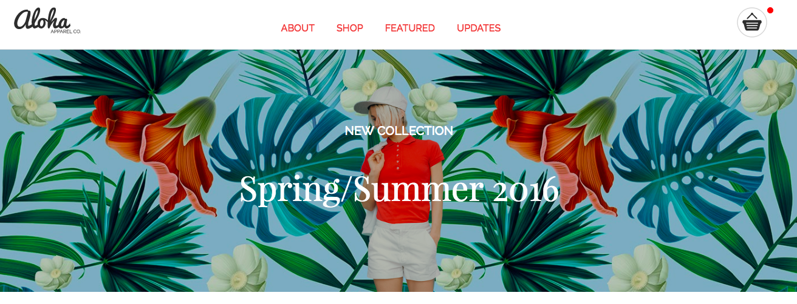

##Aloha Shop Homepage

[See the actual website!](https://haninmustafa.github.io/Aloha-Page/)
###About
This is a project website given by Red Academy. This is the second week project that have more complex tools we used. Aloha is a clothing line that allows the costumers to bay clothes online.
###Tools and Methods Used
+HTML -  for the content structure of the webpage
+CSS - for the style layout of the webpage
+JQuery -  used for the operations like the add to cart counter, responsive email and smooth scrolling
Flickity - is a jQuery plugin to give a nice image slider like a touch screen 
###General Objectives Achieved
first of all we build an HTML layer then we style that layer with CSS, in the first week we worked with flouts but in the second week we change to Flexbox. Which help us in the positioning of the images and the divs.

We also worked with Java script and JQuery in the smooth scrolling from the navigation bars to the different section in the webpage. And using the flickity plugin to give a nice slider for the clothes images. Also in the email to make sure the user add the email to subscribe and remind the user to add the email if he/she left the input empty.
one of the big challenges was in the CSS and the padding, margin and positioning. I made sure I understand the exact difference and manipulate the parameter to achieve the style I wanted.
Finally, this project was a great start to fully work with HTML, CSS and a good start in the JavaScrip and jQuery.